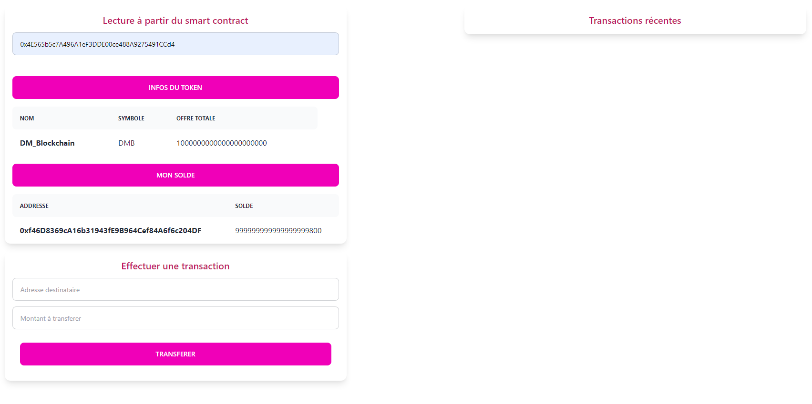
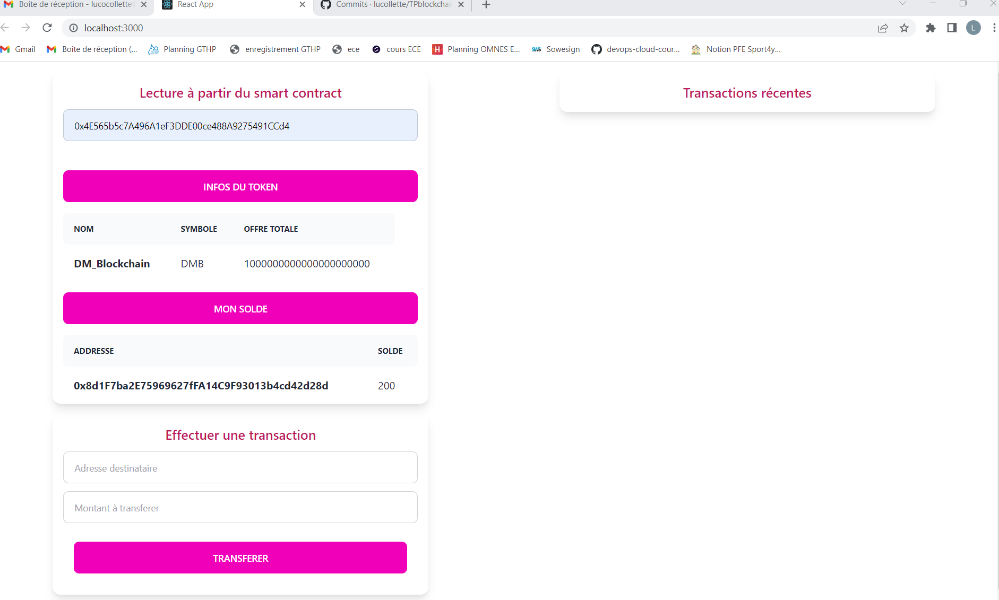
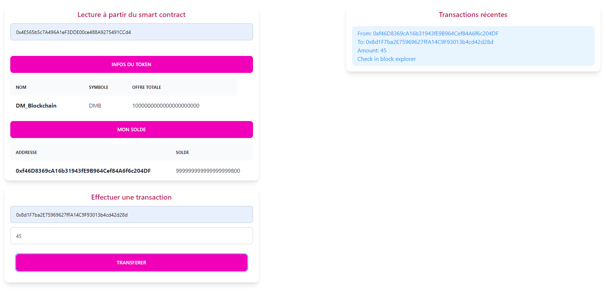
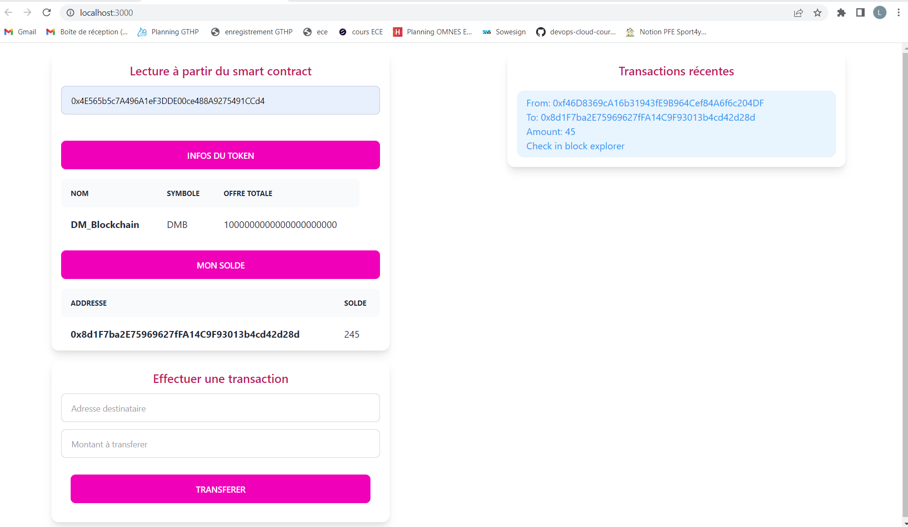
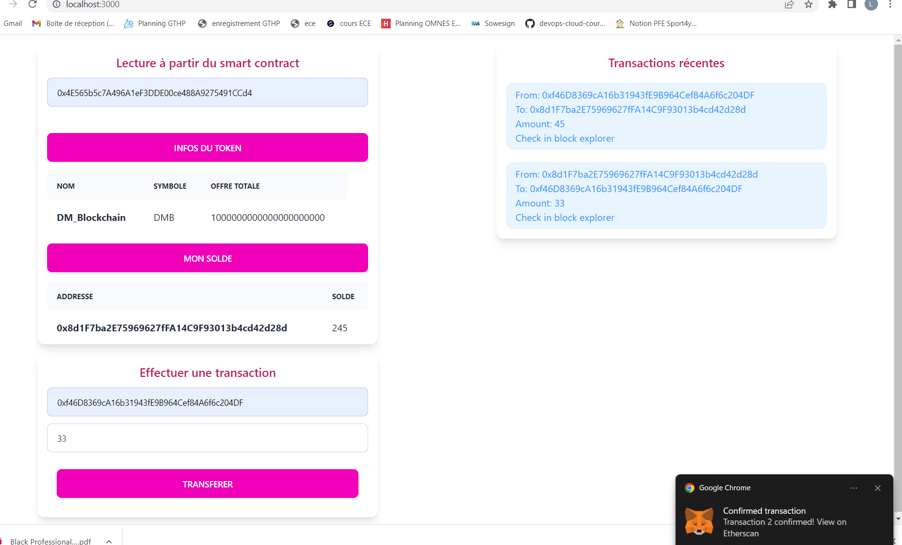
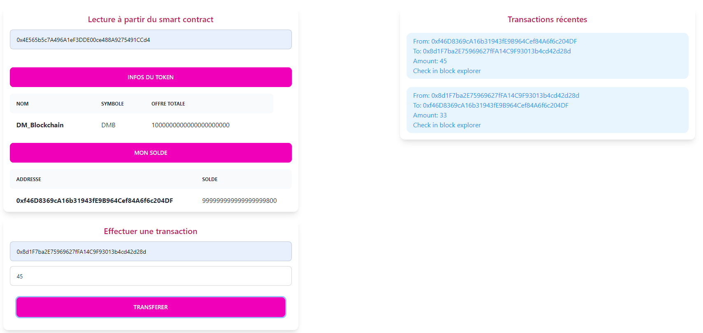
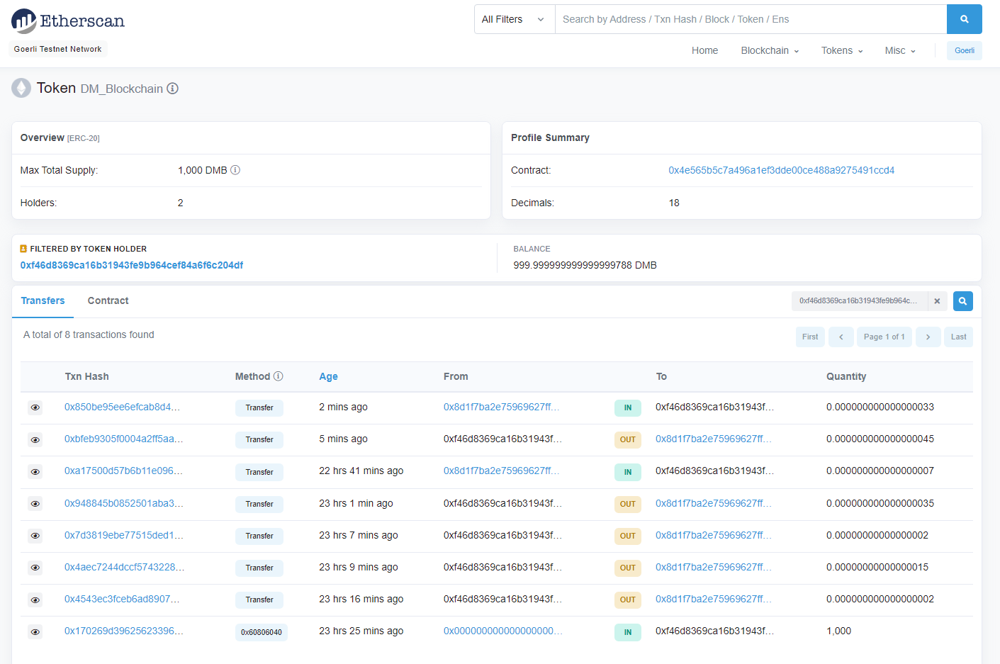

# TPblockchain

## Instruction :
- Clone the repo
- run `npm install`
- run `npm run start`
- enjoy!

## Descriptif de l'application / Comment l'utiliser

- Cette application utilise les librairies React.js et ethers
- L'application permet de lire, écrire et créer des transactions sur notre blockchain initialement créée
- Pour se faire, nous avons créé un smart contract ERC20 appelé DM_Blockchain avec comme symbole DMB et avec 10^20 tokens mintés
- L'application permet :  
  - D'avoir accès au nom, au symbole et au nombre de tokens en circulation du smart contract DM_Blockchain
  - Connaitre le solde de tokens possédés de ce smart contract sur son adresse metamask
  - D'effectuer une transaction vers une autre adresse metamask en utilisant le réseau de test goerli
  - D'avoir accès en direct aux transactions effectuées et recues avec une mise à jour automatique du solde de l'utilisateur

### Démonstration avec des captures d'écran

#### Capture d'écran 1 : Montant initial de l'utilisateur 1 en tokens DM_Blockchain

#### Capture d'écran 2 : Montant initial de l'utilisateur 2 en tokens DM_Blockchain

#### Capture d'écran 3 : Envoi de 45 tokens de l'utilisateur 1 vers l'utilisateur 2

#### Capture d'écran 4 : Réception de 45 tokens de l'utilisateur 2 de la part de l'utilisateur 1

#### Capture d'écran 5 : Envoi de 33 tokens de l'utilisateur 2 vers l'utilisateur 1

#### Capture d'écran 6 : Réception de 33 tokens de l'utilisateur 1 de la part de l'utilisateur 2

#### Capture d'écran 7 : Historique des transactions sur Etherscan

## Importance de la Blockchain

- Les tokens ERC20 utilisent le réseau Ethereum
- Ils sont éxécutés sur la blockchain
- Ils stockent des transactions et des smart contracts
- Utilisation du réseau de test goerli

#### 5 avantages de la Blockchain

- Sécurité renforcée 
- Plus de transparence
- Traçabilité instantanée
- Efficacité et rapidité
- Automatisation

## Participants OCRES ING5 TD2

- Arnaud MEILHOC
- Luc COLLETTE
- Arthur BOULANGER
